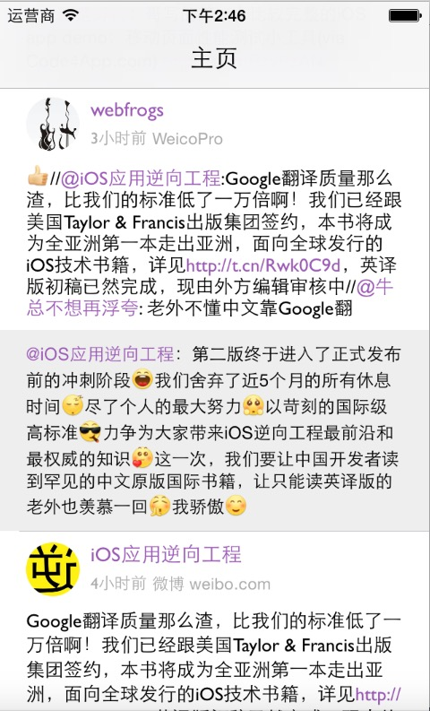

# SinaClient_Cell_Demo
一个关于新浪微博cell的小demo,自己集成label封装了一个RichLabel的类，可以自动识别@，##话题和Url，同时也支持点击。
因为是自己练手的一个小玩意，所以加入来授权页面，下拉刷新，使用了JsonModel做映射处理。

###screenshot 

 

我在github找到了很多可以识别@，话题和url的优秀开源库，但自己的主要目的时学习，所以这次主要使用使用了textkit来做，用NSTextAttachment来做了表情。

* 感谢[VVebo](https://appsto.re/cn/TNu_N.i)微博客户端，我从中提取出来来147个微博表情和对应的plist表。（由于plst的对应关系只有100个，所以会出现一些表情无法识别的问题）
* textkit参考自[KILabelDemo](https://github.com/Krelborn/KILabel)。

## Requirements

* Xcode 6
* iOS 7
* ARC

## 备注
使用前你需要在TTIClientConfig.h中替换SINA_APP_KEY、SINA_APP_SECRET和SINA_REDIRECT_URL三个参数。

附：目前内存有些问题。

