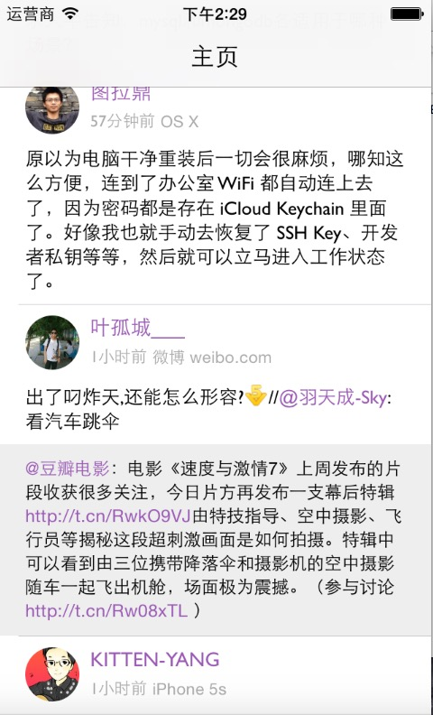

# SinaClient_Cell_Demo
一个关于新浪微博cell的小demo,自己集成label封装了一个RichLabel的类，可以自动识别@，##话题和Url，同时也支持点击。

image 

 

我在github找到了很多可以识别@，话题和url的优秀开源库，但自己的主要目的时学习，所以这次主要使用使用了textkit来做，用NSTextAttachment来做了表情。

[感谢VVebo](https://appsto.re/cn/TNu_N.i)微博客户端，我从中提取出来来147个微博表情和对应的plist表。
textkit参考自[KILabelDemo](https://github.com/Krelborn/KILabel)。

## Requirements

* Xcode 6
* iOS 7
* ARC

附：目前内存有些问题。

